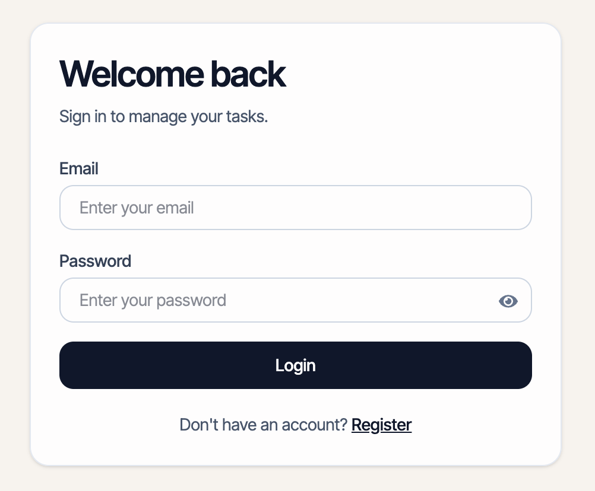
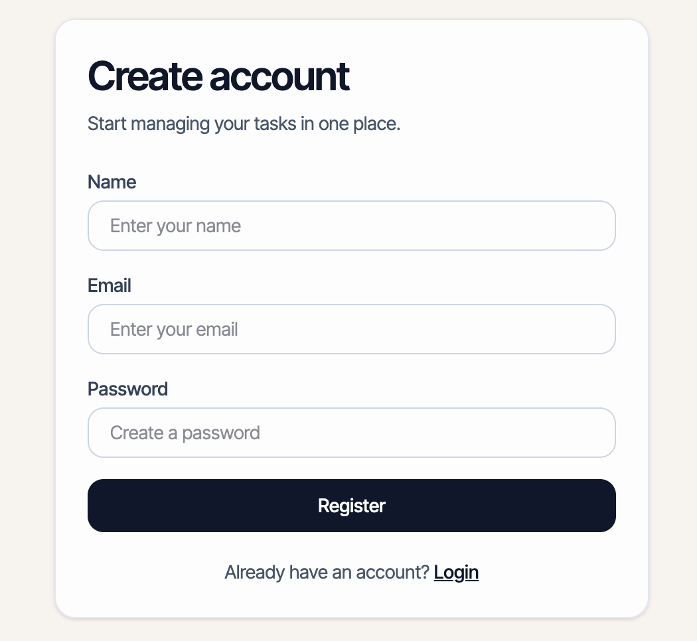
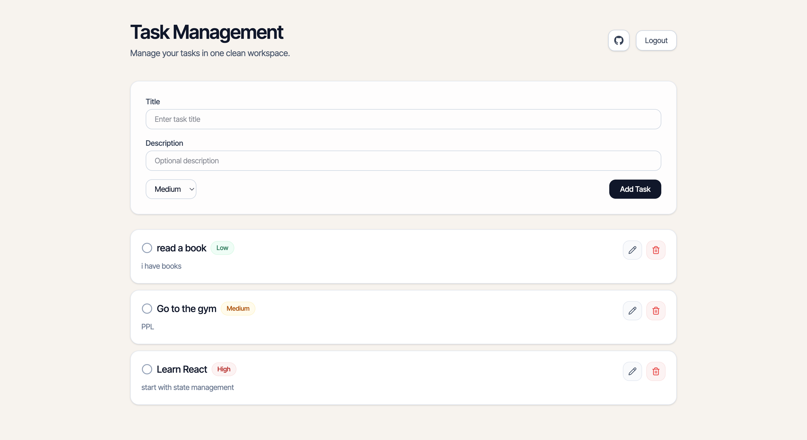

# 🧠 Task Management App (MERN Stack)

A full-stack task management application built using the **MERN stack** with authentication, CRUD operations, and a clean responsive UI.

---

## 🚀 Live Demo

- 🌐 Frontend: https://task-management-app-ao1w.vercel.app
- ⚙️ Backend API: https://task-management-app-o0nb.onrender.com

---

## ✨ Features

- 🔐 User Authentication (Register / Login / JWT)
- ✅ Create, Read, Update, Delete Tasks
- 🎯 Task Priority (Low / Medium / High)
- ✔️ Mark tasks as completed
- ✏️ Edit tasks
- 🗑️ Delete tasks
- 📱 Responsive design (mobile + desktop)
- 🌍 Deployed (Vercel + Render)

---

## 🛠️ Tech Stack

### Frontend

- React + TypeScript
- Vite
- Tailwind CSS
- Axios

### Backend

- Node.js
- Express
- MongoDB (Mongoose)
- JWT Authentication

### Deployment

- Frontend: Vercel
- Backend: Render

---

## 📂 Project Structure

```bash
task-management-app/
│
├── frontend/   # React app
└── backend/    # Express API
```

---

## ⚙️ Environment Variables

### Backend (`.env`)

```env
PORT=10000
MONGODB_URI=your_mongodb_connection
JWT_SECRET=your_secret_key
```

---

## 🧪 Run Locally

### 1. Clone the repo

```bash
git clone https://github.com/arKharashi/task-management-app.git
cd task-management-app
```

### 2. Backend

```bash
cd backend
npm install
npm run dev
```

### 3. Frontend

```bash
cd frontend
npm install
npm run dev
```

---

## 📸 Screenshots

### 🔐 Login Page



### 📝 Register Page



### 📋 Dashboard

## 

## 📌 Notes

- Backend is hosted on Render free tier → may sleep on inactivity
- First request might take ~30 seconds

---

## 👨‍💻 Author

**Abdulrahman Alkharashi**
GitHub: https://github.com/arKharashi
